# Relution Policy Workbench

[](https://github.com/sebastianspicker/relution-policy-workbench/actions/workflows/ci.yml)

Local Relution `.rexp` policy workbench for editing exports, Apple payloads, BSI/CIS baselines, and read-only device audits.

The project is built for administrators and developers who need a local, reviewable workflow for Relution policy exports, Apple `.mobileconfig` payloads, BSI/CIS/vendor baseline mappings, and read-only Relution device audits. It does not require a hosted service. The browser editor and CLI work against local files by default, and production Relution API usage is intentionally read-only.

This handles Relution policy export format v1 as observed in Relution Server `26.1.1`:

- ZIP container
- plaintext `metadata.json` and `report.json`
- encrypted `metadata.bin`
- encrypted `policies/policy_<UUID>.json`
- AES-128-GCM with PBKDF2-HMAC-SHA256

The bundled editor template data was generated from Relution Server `26.1.1` and contains:

- 19 Relution platform enum values
- 201 policy configuration detail templates
- 2067 OpenAPI schemas
- Relution runtime metadata for platform compatibility, enrollment types, multi-config flags, placeholders, and portal-hidden configuration types
- friendly generated labels for configuration types, fields, and enum values
- OpenAPI descriptions for settings where Relution exposes them
- Spring configuration metadata from the same server artifact for server-side reference metadata

## Quick Start

```sh
pnpm install
pnpm build
pnpm rexp
```

`pnpm rexp` creates `.rexp-editor/workspace` on first launch and serves the editor at `http://127.0.0.1:8787/`. You only need an encryption key when importing an encrypted `.rexp` or building an importable encrypted archive.

Optional local environment variables are documented in `.env.example`. Keep real `.env` files private; they are ignored by git.

Open an existing export, decrypt it into a local workspace, start the editor, and write a rebuilt archive:

```sh
pnpm rexp edit example/sample-policy-export.rexp \
  --key "$RELUTION_REXP_KEY" \
  --workspace example/sample-workspace \
  --out example/sample-edited.rexp \
  --force
```

Create a new blank policy workspace and serve it:

```sh
pnpm rexp serve --workspace example/sample-workspace --platform IOS --name "Example iOS Policy"
```

Do not start the editor with raw `pnpm exec vite preview`; that command serves only static frontend assets and has no `/api/*` editor backend. Use `pnpm rexp serve ...` or `pnpm rexp edit ...` so the local API and web UI are served together.

## Product Tour

### Editor Overview

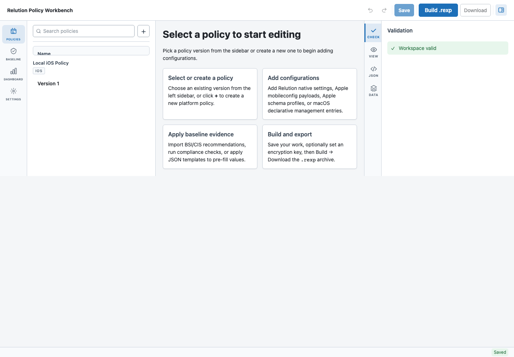

### Guided Baseline Builder

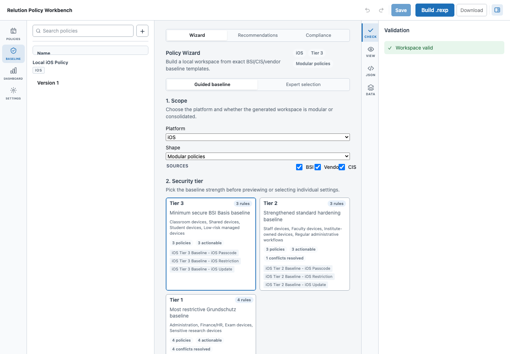

### Expert Baseline Selection

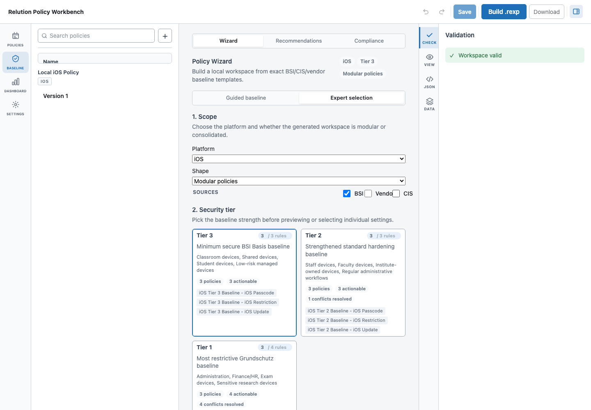

### Policy Editor

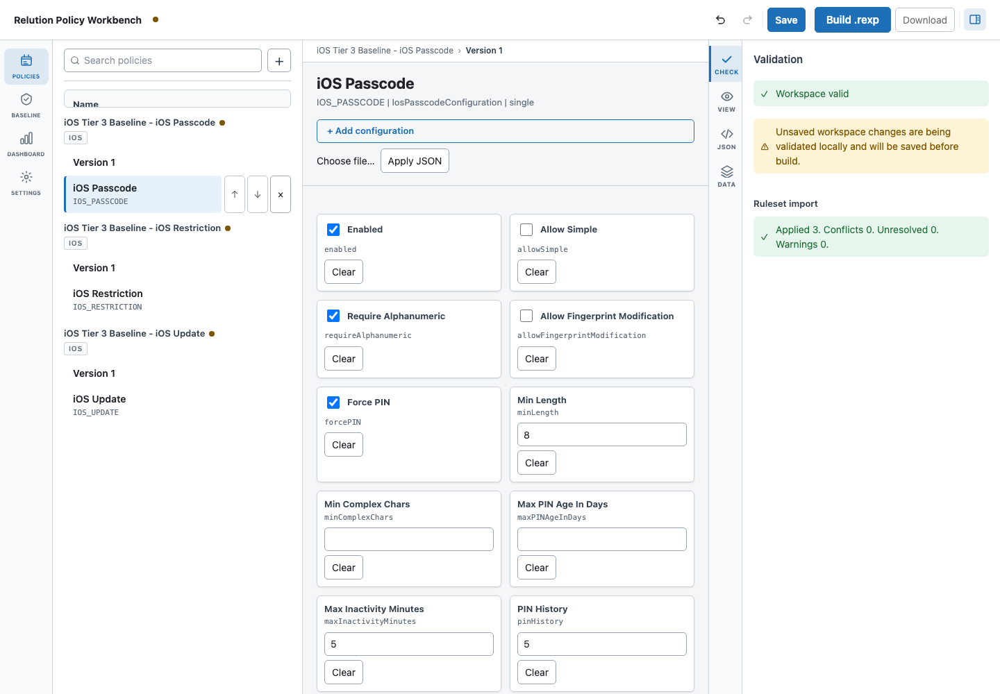

### Compliance Review

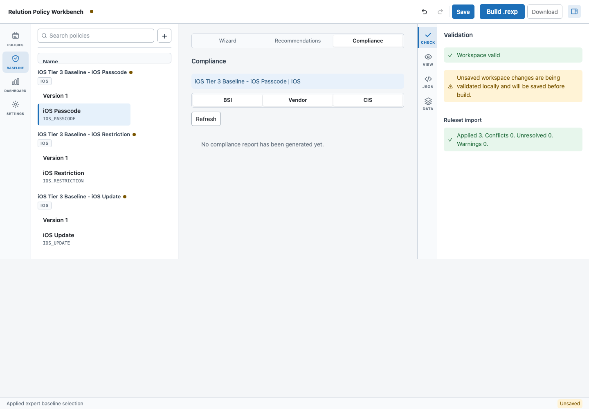

### Settings Import and Export

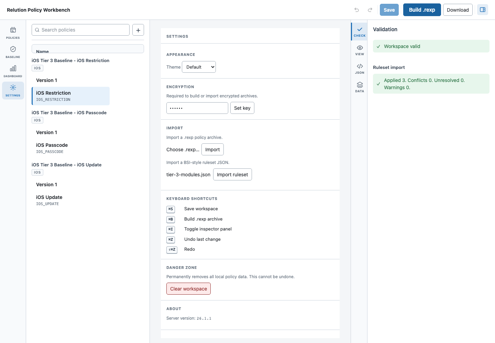

### Read-Only Relution Dashboard

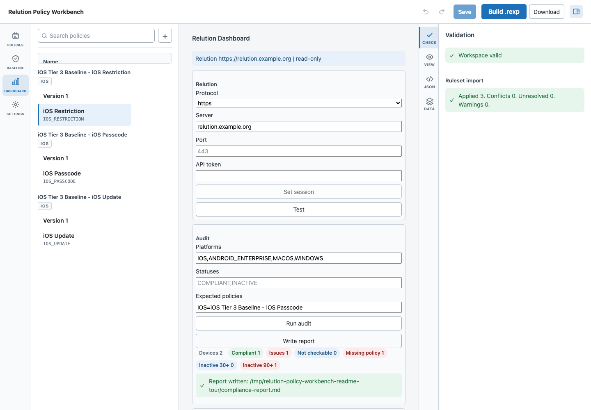

## Architecture

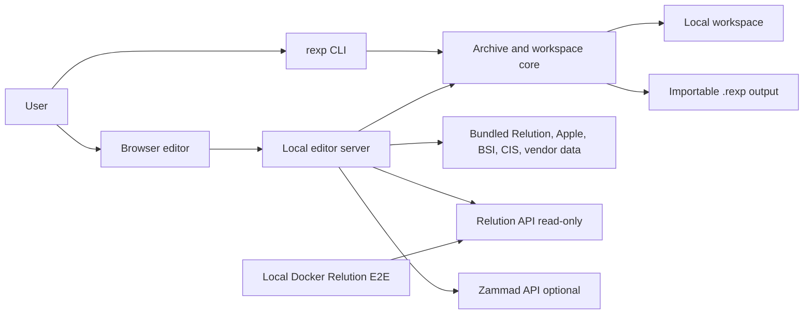

The implementation is split into a TypeScript CLI/backend in `src/`, the React editor in `web/src/`, test coverage in `test/` and `e2e/`, and evidence/build tooling in `tools/`. The editor server is intentionally local-first: it mutates local workspaces and local reports, not production Relution policy objects.

### Repository Map

- `src/cli.ts`: CLI command routing for archive inspection, workspace serving, template refreshes, Apple schema work, recommendation audits, and read-only Relution dashboard commands.
- `src/rexp.ts`: `.rexp` ZIP, encryption, hash verification, extraction, and packing core shared by the CLI and editor server.
- `src/workspace.ts`, `src/workspace-validation.ts`, `src/sidecar.ts`: local plaintext workspace model, validation, atomic persistence, and editor-only sidecar artifacts such as DDM drafts and mobileconfig restore entries.
- `src/editor-server.ts` and `src/*-routes.ts`: local HTTP API that serves the built React app, mutates the workspace, builds archives, and routes supported external workflows such as read-only Relution audits and optional Zammad ticket drafts.
- `web/src/editor/`: React editor shell, controller hooks, policy tree, settings panels, compliance UI, generated field editors, and browser-side import helpers.
- `src/recommendations.ts`, `src/compliance*.ts`, `src/baseline-*.ts`: checked-in BSI/CIS/vendor recommendation catalogs, baseline template loading, compliance evaluation, and local remediation application.
- `src/relution-*.ts` and `src/zammad-*.ts`: read-only Relution device audit integration plus optional local/Zammad ticket draft support.
- `tools/`: Python and Node generators for harvested evidence, recommendation mappings, baseline templates, and drift reports.
- `example/`, `data/`, and `docs/`: committed sample exports, generated machine-readable evidence, rendered reports, and README screenshots.
- `test/`, `e2e/`, `e2e-readme/`, `.github/workflows/`: Node/Python/unit/browser/Docker verification and CI entry points.

### Archive Lifecycle

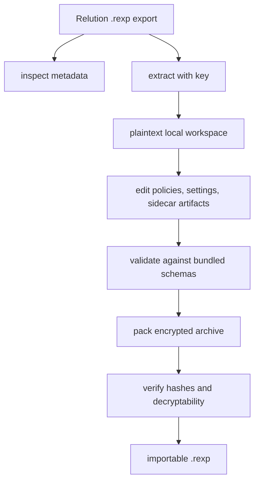

The CLI and browser editor use the same archive core. `inspect` can show metadata without a key; `extract`, `verify`, imports, and rebuilt archives need the archive key.

### Browser Editor Flow

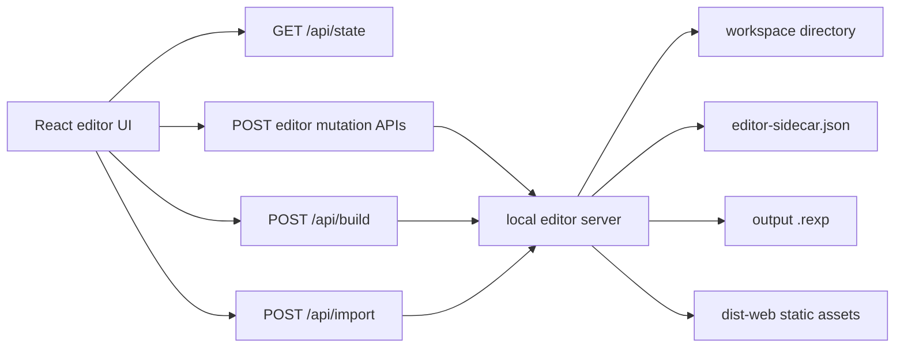

The browser can create policies, add Relution native configurations, generate Apple profile payloads, import ruleset JSON, validate changes, build encrypted archives, and download the latest output. Unsaved workspace changes are local and are saved before build.

### Recommendation and Baseline Pipeline

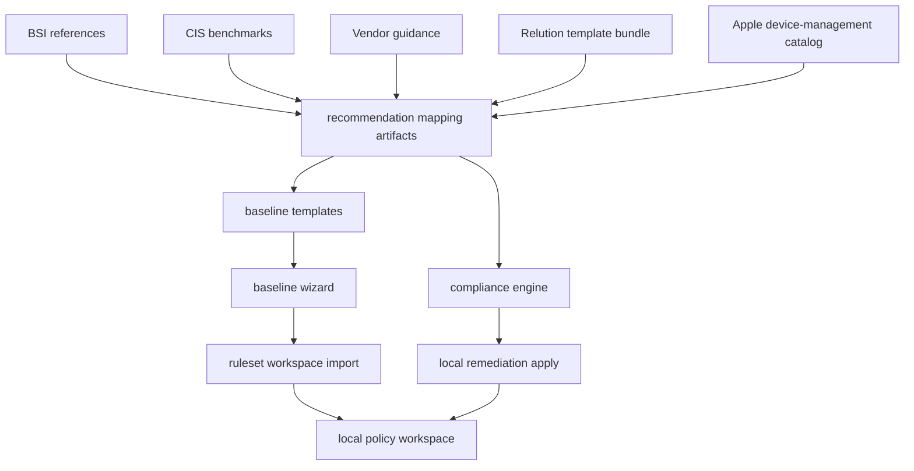

BSI remains authoritative when CIS or vendor guidance differs. Exact mappings can be imported or applied. Partial and parameterized mappings remain review or local-parameter work rather than being silently promoted.

### Verification Matrix

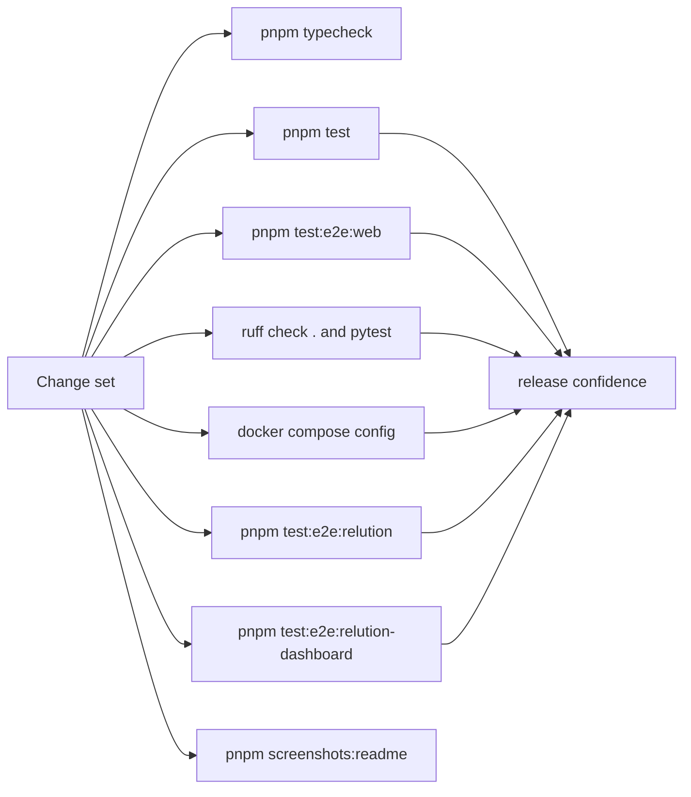

The Docker E2E tests are opt-in because they start a local Relution server and import/publish policies there. They are the only checked-in flow that writes to a Relution server, and they target the local Docker Compose service.

## CLI Reference

Inspect archive metadata:

```sh
pnpm rexp inspect example/sample-policy-export.rexp
```

Inspect and decrypt policy summaries:

```sh
pnpm rexp inspect example/sample-policy-export.rexp --key "$RELUTION_REXP_KEY"
```

Extract plaintext files for editing:

```sh
pnpm rexp extract example/sample-policy-export.rexp --key "$RELUTION_REXP_KEY" --out example/sample-extracted --force
```

Use `--pretty` if you want extracted JSON formatted for manual editing:

```sh
pnpm rexp extract example/sample-policy-export.rexp --key "$RELUTION_REXP_KEY" --out example/sample-extracted --force --pretty
```

Rebuild an importable `.rexp`:

```sh
pnpm rexp pack example/sample-extracted --key "$RELUTION_REXP_KEY" --out example/sample-roundtrip.rexp --force
```

Verify hashes and decryptability:

```sh
pnpm rexp verify example/sample-roundtrip.rexp --key "$RELUTION_REXP_KEY"
```

The password can also be provided through `RELUTION_REXP_KEY`.

After one explicit `pnpm build`, use `pnpm rexp:built <command>` for post-build CLI smoke checks without rebuilding `dist/` for every command.

## Browser Editor Capabilities

The local editor supports:

- setting the active encryption/decryption key for imports and rebuilt archives
- importing an encrypted `.rexp` archive from the browser and replacing the current workspace
- creating new policies by Relution operating system/platform
- renaming, describing, duplicating, deleting, and searching local policies before saving
- tracking unsaved changes, undoing and redoing edits, validating changes, and saving automatically before build
- searching and filtering configuration templates by source
- adding Relution native, Apple gap, Apple schema, custom settings, DDM, and MDM command entries where supported
- applying local JSON to a selected setting by deep-merging into `details` while preserving existing UUIDs
- importing structured ruleset JSON and mapping it into a complete replacement workspace
- adding `APPLE_MOBILECONFIG` configurations to Apple policies and uploading or pasting `.mobileconfig` XML
- showing friendly configuration and setting names while preserving raw Relution identifiers
- editing primitive schema fields and full nested configuration JSON
- inspecting validation, generated previews, raw configuration JSON, and sidecar artifacts
- querying productive Relution servers in read-only mode only
- writing local device audit reports and optional Zammad ticket drafts
- switching between default, organization-style, Relution-style, dark, and local custom theme tokens
- building an encrypted `.rexp`, verifying decryptability and policy hashes, and downloading the output

The editor runs locally at `http://127.0.0.1:8787/` by default. Use `--port` to change the port. Binding to a non-loopback host requires `--allow-network-editor` because the editor can mutate and rebuild local policy workspaces. Relution and Zammad editor sessions reject hosts that resolve to loopback, private, link-local, multicast, unspecified, or IPv6 ULA addresses unless local Docker or lab use is made explicit with `--allow-local-service-hosts`.

## Ruleset JSON and Baselines

Ruleset JSON import is intended for BSI-style baselines or similar control catalogs that have already been mapped to Relution targets. Explicit mappings are applied, built-in known mappings are applied, and heuristic matches are reported only as suggestions until the JSON is updated.

Generated baseline templates are available in full, modular, and tiered import shapes:

- `example/relution-baseline-templates/consolidated/*-full.json` imports one full policy per operating system.
- `example/relution-baseline-templates/modular/*-modules.json` imports the same baseline as separate non-conflicting policy blocks per Relution target or Apple payload.
- `example/relution-baseline-templates/modular/<os>/*.json` contains each block as a standalone module for selective tuning.
- `example/relution-baseline-templates/tiered/<os>/tier-*-full.json` and `tier-*-modules.json` add three deployment tiers.

Tier semantics:

- tier 3 is the minimum secure BSI Basis baseline
- tier 2 adds same-category CIS/vendor hardening where it remains non-conflicting
- tier 1 adds the most restrictive exact importable CIS/vendor hardening after BSI precedence is applied

Example ruleset:

```json
{
  "version": 1,
  "name": "Example baseline",
  "policies": [
    {
      "platform": "IOS",
      "name": "iOS baseline",
      "rules": [
        {
          "id": "bsi-ios-disable-camera",
          "title": "Disable camera"
        },
        {
          "id": "custom-associated-domains",
          "title": "Associated domains",
          "mappings": [
            {
              "kind": "apple-mobileconfig",
              "payloadType": "com.apple.associated-domains",
              "values": {}
            }
          ]
        }
      ]
    }
  ]
}
```

Supported mapping kinds are `relution-native`, `apple-mobileconfig`, and `apple-schema-profile`. Import stops with a validation report when a rule is unresolved, a target is unavailable for the policy platform, or a non-multi Relution configuration is mapped more than once.

## Apple, Jamf, DDM, and Custom Settings

List Apple settings that the editor can generate through Relution's `APPLE_MOBILECONFIG` transport:

```sh
pnpm rexp apple-compat list
```

Write the Jamf/Relution gap report:

```sh
pnpm rexp apple-compat audit
```

The editor marks generated Apple compatibility settings with `*`. The current catalog covers 22 mobileconfig-backed gap settings, including PPPC, Managed Preferences, Associated Domains, Managed Login Items, Network Relay, Certificate Transparency, Smart Card, Printing, Network Usage Rules, and System Migration. Declarative Management declarations are reported as a gap but are not generated as `.mobileconfig`, because DDM declarations are not standard configuration-profile payloads.

Local Docker E2E against Relution Server `26.1.1` confirms that generated `APPLE_MOBILECONFIG` settings import and publish into Relution. Relution's own policy `.rexp` export omits `APPLE_MOBILECONFIG` entries because the server marks that configuration class as non-exportable, so keep the editor workspace or locally generated `.rexp` as the source for those compatibility settings.

The editor also ships a vendored Apple `device-management` release snapshot generated from Apple's public schema repository. This is the schema-driven path for Apple profile, DDM, and MDM command coverage.

Refresh the vendored catalog:

```sh
pnpm rexp apple-schema refresh
```

The default refresh target follows Apple's `release` ref. Use `--revision <commit-or-tag>` when writing to a version-labeled output path or when you need reproducible catalog regeneration.

Inspect catalog counts:

```sh
pnpm rexp apple-schema audit
pnpm rexp apple-schema list --kind profile
pnpm rexp apple-schema list --kind ddm-configuration
pnpm rexp apple-schema list --kind mdm-command
```

The current pinned catalog contains 298 Apple schema entries:

- 126 Apple profile schema entries
- 36 DDM configuration declarations
- 7 DDM assets
- 1 DDM activation
- 3 DDM management declarations
- 48 DDM status items
- 65 MDM command schemas
- 9 MDM check-in schemas
- 3 DDM protocol schemas

Classic Apple profile payloads are generated as Relution `APPLE_MOBILECONFIG` configurations. DDM declarations and MDM command drafts are offline authoring artifacts stored in `editor-sidecar.json`; they are intentionally not packed into Relution `.rexp` archives.

macOS policies can add an `Application & Custom Settings` entry. It generates a `com.apple.ManagedClient.preferences` `.mobileconfig` payload using a preference domain plus managed key/value settings. Unknown keys are preserved through the raw generated payload. Payload-variable style strings are preserved verbatim by the editor; local preview/substitution is not applied to saved values.

The raw `.mobileconfig` editor detects unsigned XML profiles and opaque signed/CMS-style profile input. Signed or opaque profiles are preserved as raw content with a signature-state warning. Editing a signed profile should be treated as dropping original signature fidelity unless the profile is re-signed outside the editor.

Builds record `APPLE_MOBILECONFIG` restore snapshots in `editor-sidecar.json`. This mitigates Relution's current server-export gap: if a later Relution `.rexp` export omits mobileconfig entries, the local sidecar can be used to reconcile editor-owned payloads back into the workspace.

## Relution Dashboard and Safety Model

Production Relution API use is read-only. The editor dashboard and `rexp relution ...` CLI commands only call Relution's device base-info query endpoint. Operations such as report generation, ticket draft generation, and Zammad ticket creation are local or Zammad-side effects, not Relution server writes.

Read-only CLI commands:

```sh
pnpm rexp relution test --host relution.example.org --token "$RELUTION_TOKEN"
pnpm rexp relution devices --host relution.example.org --token "$RELUTION_TOKEN" --platform IOS --status COMPLIANT --json
pnpm rexp relution audit --host relution.example.org --token "$RELUTION_TOKEN" --expected-policy IOS="iOS Baseline" --json
```

The Docker E2E tests are the only checked-in flow that imports or publishes to a Relution server, and they target the local Docker Compose server.

## Template Data

List available configuration templates:

```sh
pnpm rexp templates list --platform IOS
pnpm rexp templates list --platform WINDOWS --json
```

Refresh the bundled template data from the current Relution Docker image:

```sh
pnpm rexp templates refresh --image relution/relution:26.1.1 --server-version 26.1.1
```

Refresh from an already extracted Relution executable JAR:

```sh
pnpm rexp templates refresh \
  --jar /tmp/relution-reverse/relution-exec.jar \
  --server-version 26.1.1 \
  --out data/relution-26.1.1/template-bundle.json
```

The refresh command reads `BOOT-INF/classes/openapi.json`, bundled iOS system app metadata, and Relution runtime configuration-type metadata. Runtime configuration-type reflection is required by default. If you intentionally need to regenerate heuristic metadata without reflection, pass `--allow-heuristic-runtime-metadata`.

## Audit and Evidence Artifacts

Run a deep local audit of the harvested Relution configuration surface and mock `.rexp` roundtrips:

```sh
pnpm rexp audit \
  --key "$RELUTION_REXP_KEY" \
  --json-out data/relution-26.1.1/audit-report.json \
  --markdown-out reports/relution-audit.md
```

The audit checks:

- platform-to-configuration coverage for all Relution platform enum values
- every harvested configuration template and field
- schema compatibility issues where Relution publishes Java/OpenAPI patterns that Node/AJV cannot compile directly
- local mock import/export compatibility by creating, validating, packing, verifying, extracting, and re-reading one `.rexp` per configuration type
- the provided example export, when present

The JSON report contains the full parameter matrix under `configurationTypes[].fields`; the Markdown report summarizes coverage and failures. The `reports/` directory is intended for local audit output and is ignored by git.

Companion evidence docs:

- `docs/JAMF_RELUTION_APPLE_GAP.md`: Apple/Jamf gap matrix for `APPLE_MOBILECONFIG` transport
- `docs/LLM_RELUTION_MAPPING.md`: offline mapping review summary for BSI, CIS, and vendor recommendations
- `docs/MAPPING_CANDIDATE_REVIEW.md`: review queues for non-exact mapping candidates
- `example/recommendation-coverage/unified-recommendation-analysis.md`: semantic grouping and BSI-precedence analysis

The machine-readable recommendation artifacts live under `example/recommendation-coverage/`. They are generated from committed evidence; no online source refresh or external LLM API call is part of those checked-in artifacts.

## Verification

Core local checks:

```sh
pnpm typecheck
pnpm test
pnpm test:e2e:web
ruff check .
uv run pytest
docker compose -f docker-compose.relution-e2e.yml config --quiet
```

Opt-in Docker checks:

```sh
pnpm test:e2e:relution
pnpm test:e2e:relution-dashboard
```

Documentation screenshot refresh:

```sh
pnpm screenshots:readme
```

`pnpm test` is the default local/CI gate. It rebuilds `dist/` and `dist-web/` from source, runs the Node integration suite, and runs the browser-layer Vitest/jsdom tests for editor field behavior.

GitHub Actions runs `pnpm typecheck` and `pnpm test` on push and pull request.

`pnpm test:e2e:relution` is an opt-in Docker E2E check, not part of the default CI gate. It starts the local Docker Compose stack in `docker-compose.relution-e2e.yml`, imports a generated `.rexp`, publishes the policy, checks Relution's API for the mobileconfig-backed configuration, exports the policy again, and verifies the exported archive. The repo also exposes this Docker E2E as a separate scheduled/manual GitHub Actions workflow with Docker log capture.

`pnpm test:e2e:relution-dashboard` is a narrower opt-in Docker E2E for the API dashboard path. It imports a generated JSON baseline template as a `.rexp`, imports and publishes it in the local Relution Docker server, exports it again, then starts the local editor server and exercises the Relution dashboard audit/report API against scoped mock device data. The dashboard probe uses a deterministic local token unless `RELUTION_E2E_ACCESS_TOKEN` is set explicitly; local Docker import/export management calls use `RELUTION_E2E_USERNAME` / `RELUTION_E2E_PASSWORD` unless `RELUTION_E2E_MANAGEMENT_ACCESS_TOKEN` is set explicitly.

Prerequisites for `pnpm test:e2e:relution`:

- Docker Engine with Compose v2 available locally
- a free host port for `RELUTION_DOCKER_PORT` (default `8080`)
- enough memory for the Relution JVM heap setting (`RELUTION_DOCKER_MEMORY`, default `1536m`; this passes through to the container's `RELUTION_MEMORY`)
- a longer startup window for database and application health checks

Useful overrides:

```sh
RELUTION_DOCKER_IMAGE=relution/relution:26.1.1
RELUTION_DOCKER_PORT=8080
RELUTION_DOCKER_MEMORY=1536m
RELUTION_DOCKER_KEEP=1
RELUTION_E2E_ACCESS_TOKEN=<optional-dashboard-token-override>
RELUTION_E2E_MANAGEMENT_ACCESS_TOKEN=<optional-management-token>
```

## License

MIT. See `LICENSE`.
